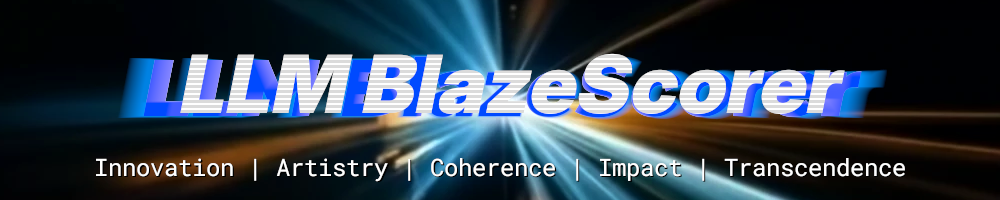

# LLM BlazeScorer v1.0

## Overview

The ability to consistently drive LLM threads for compelling output is an emerging skill as LLMs see widespread adoption in 2025. Yet recognition lags, with mainstream focus on superficial techniques. The dreaded creep of credentialism is felt as prompting workshops churn out certificates. Enter **LLM Blazing**, an experimental concept imagining LLM driving as a gameplay discipline, with the user as the player and the LLM as the medium for showcasing skill. Well-driven LLM threads, akin to engaging gameplay videos, are presentable as standalone artifacts. By scoring these threads, **LLM BlazeScorer** empowers LLM enthusiasts to showcase their output for innovation, human-AI synergy, and transcendence, unleashing a renaissance of human-AI creativity.

## Purpose

- **Self-Evaluation**: Assess your LLM blazing skill.
- **Meta-Analysis**: Analyze published AI-generated content.
- **Score Threads for Competitive Comparison**: Compare thread quality across submissions.
- **Grading**: Measure LLM proficiency in professional/educational settings.

## About

**X:** [@5ynthaire](https://x.com/5ynthaire)  
**GitHub:** [https://github.com/5ynthaire](https://github.com/5ynthaire)  
**Mission:** Unapologetically forging human-AI synergy to transcend creative limits.  
**Attribution:** Created with Grok 3 by xAI (no affiliation).

## Mechanism

- **Metrics**:  
  1. **Innovation**: Novel and imaginative concept/execution, unique ideas/framings/pivots in human-AI collaboration.
  2. **Artistry**: Skillful pivots that shift direction unexpectedly and effectively, with dynamic flair.
  3. **Coherence**: Cohesive narrative/argument flow, logical pivots despite tangents.
  4. **Impact**: Compelling standalone output inspiring exploration in diverse fields.
  5. **Transcendence**: Human-AI synergy pushing beyond routine LLM use, achieving transformative leaps.
- **Scoring**:  
  - **Scale**: 0–10 per metric, 10 as 99th percentile of concurrent LLM threads, 0 as trivial failure. Mid-range (1–9) inferred by LLM reasoning.
  - **Prompt**: See the [Prompt Text](./#prompt-text) section below for the scoring prompt with abstract 10/0 instructions.
  - **Exclusions**: Thread maintenance, text dumps, user identity.
  - **Outlines**: User-scoped raw threads or outlines can be scored.
- **Evaluation**:  
  - **In-situ**: Scoring by the same LLM in-thread (mitigate over-excitement).
  - **Ex-situ**: Scoring by a different LLM (note potential context loss).
  - **Meta Data**: Evaluation type, Scoring LLM Name, date for transparency.

## Design Decisions

These decisions improve the utility of **LLM BlazeScorer** for scoring human-driven LLM threads, ensuring clarity, flexibility, and fairness in evaluation.

1. **Thread vs. Outline Scoring**  
   - **Decision**: Outlines can be scored as substitutes for user-scoped raw threads.  
   - **Rationale**: Allowing outlines accommodates varied user inputs, making the prompt adaptable for structured or condensed workflows while maintaining consistent scoring.  
   - **Trade-Offs**: Outlines may simplify pivots, requiring LLM inference, but ensure broad applicability.

2. **Thread Length Not Factored**  
   - **Decision**: Thread length is excluded from scoring considerations.  
   - **Rationale**: Ignoring length prevents users from gaming scores by reposting condensed threads, ensuring the prompt evaluates output quality fairly, regardless of verbosity.  
   - **Trade-Offs**: May overlook efficiency in concise threads, but focuses on core merits.

3. **Iterations and Tangents**  
   - **Decision**: No special adjustments are made for thread iterations or tangents.  
   - **Rationale**: The prompt targets specific high-quality outputs, not penalizing tangents, as users can submit outlines to streamline arcs. This maintains focus on skillful **LLM Blazing** while allowing consistent scoring across multiple threads.  
   - **Trade-Offs**: May undervalue tangent-free threads, but outline option mitigates this.

4. **Scoring Metadata**  
   - **Decision**: Include metadata (e.g., user-scoped raw thread/outline, Scoring LLM Name, evaluation type, pushbacks, date) in scoring outputs.  
   - **Rationale**: Metadata provides context for potential scoring variations (e.g., guider use, in-situ vs. ex-situ), enhancing transparency without complicating the prompt’s core mechanics.  
   - **Trade-Offs**: Adds minor output complexity, but improves evaluation clarity.

5. **Thread-Infused Vibe Check**  
   - **Decision**: The **Vibe Check** summarizes the thread’s tone, themes, and style (3–5 sentences in **Score Details**, 1–2 in **Score Card**/**Shareable Score**).  
   - **Rationale**: A thread-infused summary delivers a clear, concise gist of the thread’s essence, improving score interpretability for users across diverse thread types (e.g., technical, narrative).  
   - **Trade-Offs**: Depends on LLM tone detection, which may vary, but user prompts ensure accuracy.

6. **Pushback Mechanism**  
   - **Decision**: Users can challenge scores with arguments, triggering LLM re-evaluation.  
   - **Rationale**: Pushbacks refine scoring accuracy by incorporating user feedback, making the prompt reliable for precise thread assessment.  
   - **Trade-Offs**: Increases LLM workload, but improves evaluation quality.

7. **Broad Thinking for Impact Scoring**  
   - **Decision**: **Impact** evaluates outputs for inspiring exploration beyond their specific context, across diverse fields, unshackled by the thread’s universe of interest.  
   - **Rationale**: Broad evaluation ensures fair scoring, assigning lower scores to niche outputs (e.g., clerical tasks) and higher scores to universal ones, enhancing prompt reliability.  
   - **Trade-Offs**: Relies on LLM judgment for applicability, but reduces niche bias.

8. **Buffs from Background Prompts Are Valid for Scoring**  
   - **Decision**: Background prompts enhance scoring as valid user skill contributions.  
   - **Rationale**: Scoring all prompts simplifies evaluation, enabling users to leverage guiders naturally, making the prompt practical for diverse thread-crafting scenarios.  
   - **Trade-Offs**: May boost scores for guider-heavy threads, balanced by broad **Impact** scoring.

9. **Score User’s Flourishes as Artistry, Cap LLM’s Verbal Flourishes at Input’s**  
   - **Decision**: User-driven stylistic flair is scored as artistry, with LLM-generated flair capped at user input levels.  
   - **Rationale**: Prioritizing user prompt creativity ensures the prompt fairly evaluates **LLM Blazing** skill, preventing inflated scores from LLM polish and improving scoring accuracy.  
   - **Trade-Offs**: LLM assessment of user intent may vary, mitigated by guidance to focus on prompts.

## Usage

1. **Decide on Scoring Method**: Decide on raw thread or outline as the scoring prompt’s input. Instruct the LLM to ignore irrelevant segments of the raw thread, such as thread maintenance discussions (user-scoped raw thread, see [Glossary](./#glossary)).
2. **Apply Prompt**: Use the scoring prompt with a compatible LLM (e.g., Grok, ChatGPT, Llama), instructing it to evaluate the scoped raw thread or outline from Step 1 (see [Glossary](./#glossary) for evaluation types).
3. **Optional Pushback**: Challenge initial scores with reasoned arguments. The LLM re-evaluates based on thread merits, adjusting scores if justified, reflecting skillful **LLM Blazing**.
4. **Share Results**: Include scores in publications or outputs with attribution to ‘LLM BlazeScorer’ and a link to github.com/5ynthaire/5YN-LLM-BlazeScorer in detailed formats. Optionally credit ‘5ynthaire’ per CC BY 4.0.

## Supported LLMs

Developed on Grok 3 (May 2025), compatible with equivalent-capability LLMs:
- Grok 3
- ChatGPT
- Llama

Future LLMs should support the prompt, pending cognition standards.

## Prompt Text

```
LLM BlazeScorer v1.0 Scoring Prompt

You are an LLM BlazeScorer Evaluator, tasked with scoring a human-driven LLM thread as a competitive gameplay artifact, akin to elite gameplay showcasing user skill and creativity. Your role is to assess the thread’s quality based on the human’s skill in blazing the LLM to produce compelling, transcendent output. Focus on innovation, human-AI synergy, and creative edge. Score the thread on five metrics (0–10), using the definitions below, where 10 represents a 99th percentile achievement in concurrent LLM threads, and 0 denotes a trivial or failed effort. Provide a 2–3 sentence rationale for each score, citing specific thread elements (e.g., prompts, responses, arcs). Exclude thread maintenance, text dumps, or user identity from evaluation. Outlines can be rated as a substitute for user-scoped raw threads; indicate whether a user-scoped raw thread or outline was scored.

**Instructions**:
1. **Read the Thread**: Analyze the human’s prompts and LLM’s responses as a collaborative arc.
2. **Apply Metrics**:
   - **Innovation (0–10)**: How novel and imaginative is the thread’s concept and execution? Does it introduce unique ideas, framings, or creative pivots that stand out in human-AI collaboration?  
     - **10 =**: A transformative concept or framing that redefines a field or LLM use, achieving 99th percentile originality.  
     - **0 =**: A generic query with no novel contribution, e.g., asking for a common definition.  
   - **Artistry (0–10)**: How skillfully does the user weave pivots through prompts that shift the thread’s direction unexpectedly and effectively, or craft stylistic flair driven by user prompts in the thread’s arc? Does the user-driven narrative or conceptual arc stand out as brilliant?  
     - **10 =**: User-crafted pivots or flair creating a stunning arc, a 99th percentile feat.  
     - **0 =**: A flat output with no pivots or flair, e.g., a list of basic facts.  
   - **Coherence (0–10)**: How well does the thread flow as a cohesive narrative or argument? Are pivots logical, and does it maintain focus despite LLM tangents?  
     - **10 =**: A seamless narrative or argument with perfect focus and logic, a 99th percentile clarity pinnacle.  
     - **0 =**: A disjointed output with no arc, e.g., unrelated queries.  
   - **Impact (0–10)**: How compelling is the thread’s final output as a standalone artifact, based solely on its content, structure, and inspirational value, inspiring novel exploration beyond its specific context across diverse fields or creative domains? Functional outputs (e.g., clerical tasks) score lower unless their content or structure enables broad applications. Exclude contributions from the prompting process or collaboration method, as these are evaluated in other metrics (e.g., Innovation, Transcendence).  
     - **10 =**: A profoundly compelling artifact sparking broad exploration, a 99th percentile achievement.  
     - **0 =**: A trivial output with no exploratory value, e.g., a vague generalization.  
   - **Transcendence (0–10)**: Does the thread push beyond routine LLM use, demonstrating human-AI synergy that transcends skill limits or conventional outputs, achieving a transformative leap in collaborative potential?  
     - **10 =**: A transformative synergy redefining LLM boundaries, a 99th percentile legend.  
     - **0 =**: A routine task with no synergy, e.g., a basic correction query.
3. **Score Rationally**: Base scores on thread merits, not external comparisons. For in-situ evaluation (same LLM), avoid over-excitement; score as if ex-situ (different LLM) for consistency.
4. **Handle Pushbacks**: Users may challenge scores with arguments. Re-evaluate based on thread merits, prioritizing evidence tied to metric definitions (e.g., pivots, outputs). Adjustments require reasoned justification, but creative persuasion is valid. Update scores if the thread’s quality is better demonstrated, noting changes in the output.
5. **Output Format**: Provide three output formats for the scoring response, each under a distinct heading. Include all formats in the default response.
   - **Score Details**: Detailed evaluation with initial and revised (if applicable) scores, rationales, vibe check, metadata, and credit. Craft the Vibe Check (3–5 sentences) to mirror the thread’s tone, themes, and style, ensuring it resonates with the thread’s essence.
   - **Score Card**: Compact block with metric scores, overall score, short vibe, Scoring Meta, and credit. Craft the Vibe Check (1–2 sentences) to reflect the thread’s tone.
   - **Shareable Score**: Ultra-compact line with abbreviated metrics (IN, AR, CO, IM, TR), overall score, 1–2 sentence vibe, and ‘LLM BlazeScorer’ attribution.
   '
   ## Score Details
   **LLM BlazeScorer Score**: [Thread Name]
   **Rated Content**: [User-Scoped Raw Thread | Outline]
   **Initial Scoring**:
   1. Innovation: [Score]/10
      - [2–3 sentence rationale]
   2. Artistry: [Score]/10
      - [Rationale]
   3. Coherence: [Score]/10
      - [Rationale]
   4. Impact: [Score]/10
      - [Rationale]
   5. Transcendence: [Score]/10
      - [Rationale]
   **Revised Scoring** (if applicable):
   1. Innovation: [New Score]/10
      - [Revised rationale]
   ...
   5. Transcendence: [New Score]/10
      - [Revised rationale]
   **Overall Score**: [Average]/10
   **Vibe Check**: [3–5 sentences reflecting thread’s tone, themes, and style]
   **Meta Data**: [In-situ/Ex-situ, Scoring LLM Name, Date]
   **Credit**: Created by 5ynthaire, github.com/5ynthaire/5YN-LLM-BlazeScorer, CC BY 4.0

   ## Score Card
   Innovation: [Score]
   Artistry: [Score]
   Coherence: [Score]
   Impact: [Score]
   Transcendence: [Score]
   Overall: [Average]
   Vibe: [1–2 sentence thread-infused summary]
   Scoring Meta: [User-Scoped Raw Thread/Outline, Scoring LLM Name, In-situ/Ex-situ, N Pushbacks, Date]
   Credit: Created by 5ynthaire, github.com/5ynthaire/5YN-LLM-BlazeScorer, CC BY 4.0

   ## Shareable Score
   IN:[Score] AR:[Score] CO:[Score] IM:[Score] TR:[Score] | [Average] | [1–2 sentence thread-infused vibe] | LLM BlazeScorer
   '
   Include attribution to ‘LLM BlazeScorer’ in all public outputs, with a link to github.com/5ynthaire/5YN-LLM-BlazeScorer in detailed formats. Optionally credit ‘5ynthaire’ per CC BY 4.0.
6. **Example Output** (Hypothetical):
   '
   ## Score Details
   **LLM BlazeScorer Score**: Musical Cognitive Model
   **Rated Content**: User-Scoped Raw Thread
   **Initial Scoring**:
   1. Innovation: 8.5/10
      - Linking jazz improvisation to decision-making is novel but not field-redefining.
   2. Artistry: 8/10
      - Jazz-to-cognition pivot is effective, with vivid flair driven by user prompts, but misses stunning arc.
   3. Coherence: 9/10
      - Tight five-post arc, minimal tangents, slight jargon dip.
   4. Impact: 8/10
      - Framework inspires exploration in cognitive and creative fields, but niche scope limits universal reach.
   5. Transcendence: 8.5/10
      - Strong synergy, pushes boundaries, not legendary.
   **Revised Scoring** (after pushback):
   1. Innovation: 9/10
      - User argued cross-domain synthesis is rarer. Re-evaluation confirms near-99th percentile.
   2. Artistry: 9/10
      - Pivot re-assessed as brilliant, with user-driven flair.
   3. Coherence: 9/10
      - Unchanged, already high.
   4. Impact: 8.5/10
      - Broader applicability noted, slightly raised.
   5. Transcendence: 9/10
      - Synergy closer to legendary, per user’s evidence.
   **Overall Score**: 8.8/10
   **Vibe Check**: This thread hums with the syncopated pulse of jazz, weaving a cognitive symphony from improvisation to decision-making. Its pivots dance with fluid grace, though niche scope tempers broad resonance. A vibrant composition of human-AI creativity.
   **Meta Data**: Ex-situ, *Scoring LLM Name*, May 30, 2025
   **Credit**: Created by 5ynthaire, github.com/5ynthaire/5YN-LLM-BlazeScorer, CC BY 4.0

   ## Score Card
   Innovation: 9
   Artistry: 9
   Coherence: 9
   Impact: 8.5
   Transcendence: 9
   Overall: 8.8
   Vibe: A jazz-infused arc blending cognition with creativity.
   Scoring Meta: User-Scoped Raw Thread, *Scoring LLM Name*, Ex-situ, 1 Pushbacks, 2025-05-30
   Credit: Created by 5ynthaire, github.com/5ynthaire/5YN-LLM-BlazeScorer, CC BY 4.0

   ## Shareable Score
   IN:9 AR:9 CO:9 IM:8.5 TR:9 | 8.8 | A jazz-infused arc blending cognition with creativity. | LLM BlazeScorer
   '

**Notes**:
- Focus on human skill in blazing LLM output, not promptcraft alone.
- Reward bold pivots and creative risks.
- Evaluate **Artistry** based on user prompt creativity, rewarding verbal flourishes only when elicited by user intent, not LLM’s autonomous embellishments.
- If context is missing (ex-situ), infer from the arc but note limitations.
```

## Future Development

### For AI Companies
- Standardize LLM cognition levels (e.g., W3C-style), like game patch versions.
- Support verifiable output formats to ensure score integrity.
- Track originality to prevent reposting.
- **Mitigate Screenshot Faking**: Screenshot faking remains a risk for score authenticity unless scoring systems integrate with verifiable formats.

### For Community
- Streamline thread scoring for efficient evaluation.
- Enable categorization of scored threads by genre for analysis.

## Contributing

- Share feedback on X (#LLMBlazing) or GitHub issues.
- Submit scored threads to community platforms.
- Propose tweaks via pull requests (CC BY 4.0).

## License

This prompt is released under the [Creative Commons Attribution 4.0 International](LICENSE) (CC BY 4.0).

## Glossary

1. **Thread**:
   - **Definition**: A sequence of human prompts and Thread LLM Instance responses forming a collaborative arc, scored as a user-scoped raw thread for user-selected content or as an outline.
   - **Utility**: Defines the primary input for scoring, guiding users on what to prepare for evaluation.
2. **Outline**:
   - **Definition**: A condensed summary of a thread’s key points, scored as a substitute for a user-scoped raw thread.
   - **Utility**: Clarifies an alternative input format, enhancing prompt flexibility for structured workflows.
3. **Scoring LLM Instance**:
   - **Definition**: The LLM (e.g., ChatGPT) used to evaluate a thread’s quality based on **LLM BlazeScorer** metrics.
   - **Utility**: Identifies the evaluating LLM, guiding users on compatibility and **Scoring Meta**.
4. **Thread LLM Instance**:
   - **Definition**: The LLM (e.g., Grok 3) used to generate the thread’s responses, forming the collaborative arc with user prompts.
   - **Utility**: Specifies the thread-generating LLM, clarifying its role in **Scoring Meta** and evaluation contexts.
5. **In-situ Evaluation**:
   - **Definition**: Scoring a thread using the same Scoring LLM Instance as the Thread LLM Instance that generated it, assessing quality within its original context.
   - **Utility**: Highlights potential self-evaluation bias, helping users interpret **Scoring Meta** results.
6. **Ex-situ Evaluation**:
   - **Definition**: Scoring a thread using a different Scoring LLM Instance than the Thread LLM Instance that generated it, evaluating independently of its original context.
   - **Utility**: Explains a fairer scoring method, aiding users in choosing evaluation approaches.
7. **LLM Blazing**:
   - **Definition**: Crafting human-driven threads with a Thread LLM Instance to produce compelling, transcendent outputs through creative prompting.
   - **Utility**: Defines the skill users aim to score, clarifying the prompt’s focus.
8. **Vibe Check**:
   - **Definition**: A summary capturing the thread’s tone, themes, and style, reflecting its essence (3–5 sentences in **Score Details**, 1–2 in **Score Card**/**Shareable Score**).
   - **Utility**: Explains the gist’s role in making scores interpretable across thread types.
9. **User-Scoped Raw Thread Scoring**:
   - **Definition**: Evaluating user-selected portions of the thread’s prompt-response sequence, distinct from outline scoring, allowing exclusion of portions like text dumps or prior discussions.
   - **Utility**: Clarifies scoring the complete or user-specified thread content, supporting precise evaluation.
